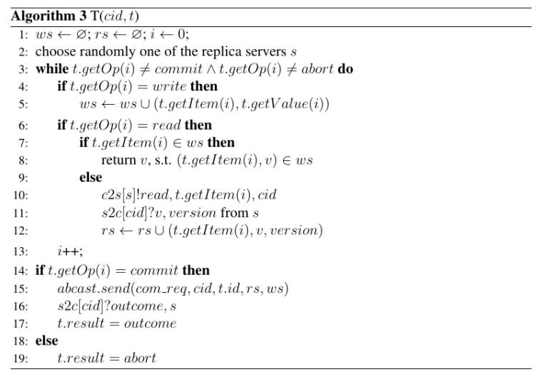
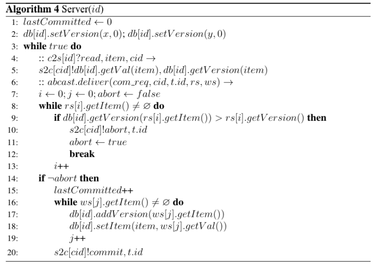

# Deferred Update Replication

Trabalho Final na disciplina de Computação Distribuída (UFSC 2025/1)

Controle de Concorrência em Transações com Replicação de Atualização Adiada (Deferred Update Replication).

Deverá ser implementado o protocolo DUR, com base nos algoritmos apresentados e
literatura complementar, se necessário. Para a comunicação, serão utilizadas primitivas 1:1,
do tipo send(m) e receive(m) e 1:n, do tipo broadcast(m) e deliver(m).
Para as primitivas 1:1, podem ser utilizados sockets TCP, que garantirão a entrega e ordem
FIFO. Para a comunicação 1:n, será necessário implementar algum algoritmo de difusão
atômica. Para este trabalho, pode-se assumir que os nodos não irão falhar, então mesmo
uma implementação ingênua de difusão deve ser suficiente, por exemplo o Best-effort
Broadcast (BEB) [Guerraoui et al. 2011], abordagens baseadas em um nodo sequenciador
de mensagens, etc. [Défago et al. 2004].
Devem ser implementados:

1. Os servidores gerenciadores de dados (pode ser um key-value store, por exemplo), que podem ser replicados;

2. Clientes concorrentes, responsáveis por produzir transações que operam sobre os dados gerenciados pelos servidores.

3. Casos de teste para validar o protocolos. Elabore situações de concorrência entre clientes em que transações serão efetivadas com sucesso e abortadas (dica: você pode adicionar tempos de espera entre execuções de operações das transações, de modo a forçar situações
de interesse).
O formato das mensagens, configurações, etc. ficam à seu critério.
Entrega

O trabalho consiste em implementar o programa, incluindo:
- Biblioteca para difusão atômica (abcast)
- Protocolo DUR
- Partes cliente e servidor para teste

# Uso da aplicação

Na raiz do projeto, basta instanciar os servidores e sequenciador com o script `main.py` fazendo uma chamada `python main.py`. Com os servidores instanciados, pode-se abrir um novo terminal para aplicar os casos de teste, invocando da seguinte maneira `python -m teste_cases.<numero>`, por exemplo: `python -m teste_cases.3`. Para verificação dos resultados em tempo real, pode-se utilizar o notebook "adhoc.ipynb", que já possui uma função pronta de scan do datastore, como também é possível criar transações personalizadas.